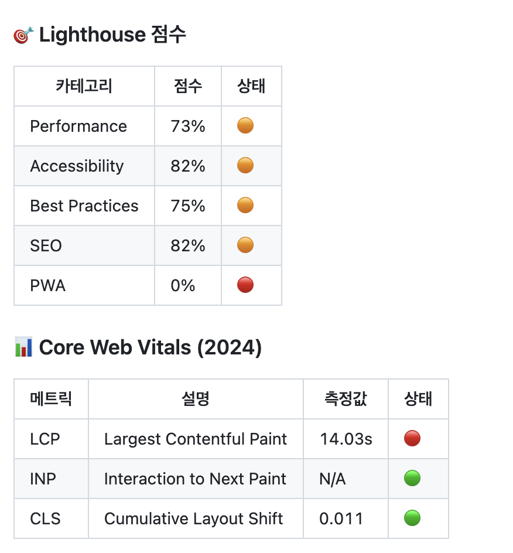
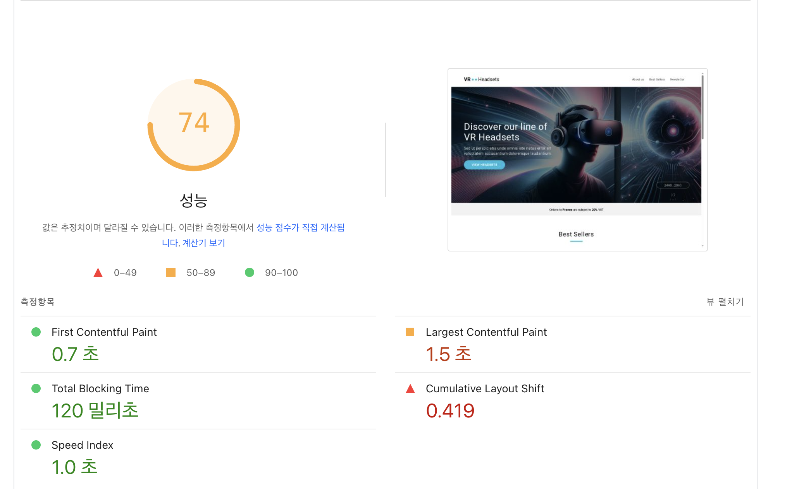
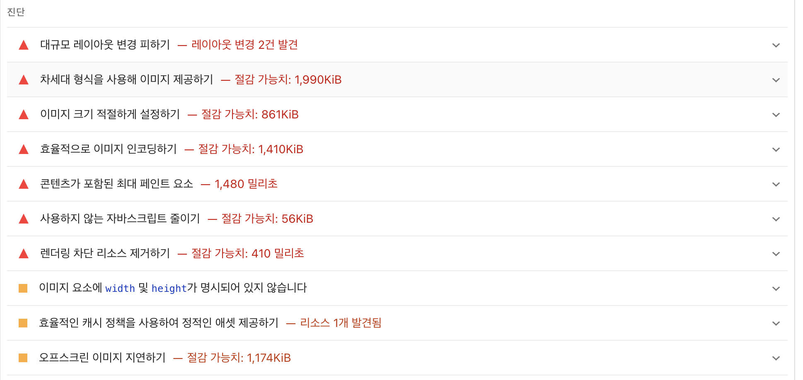
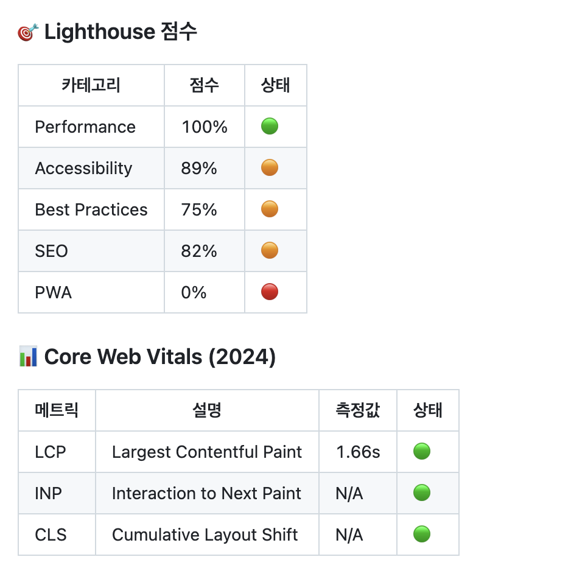
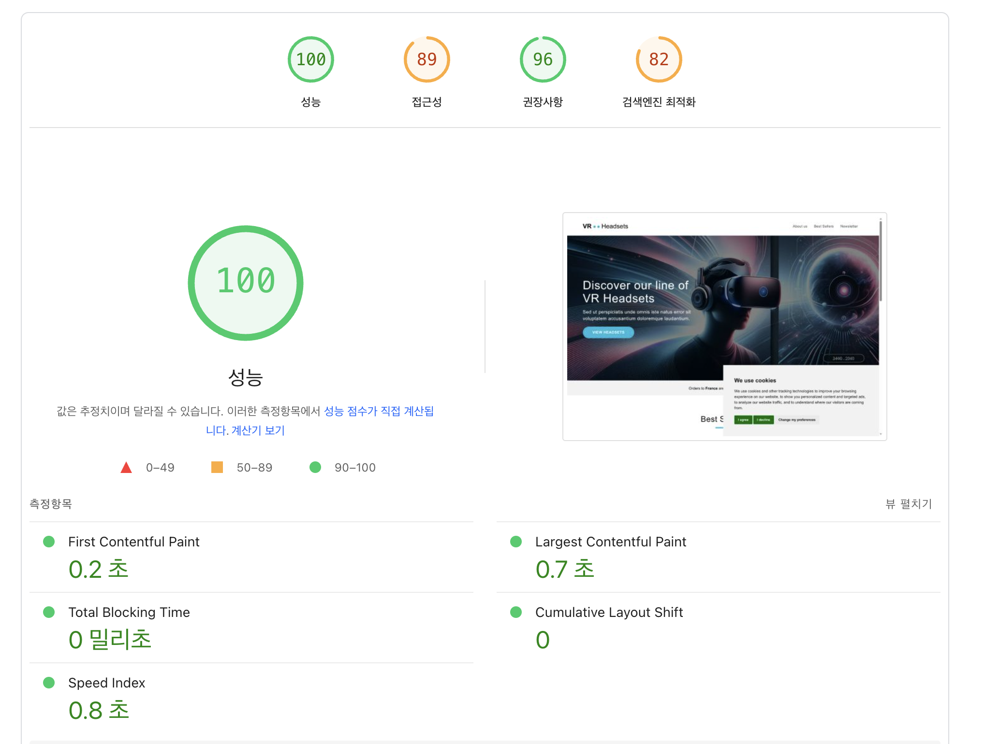
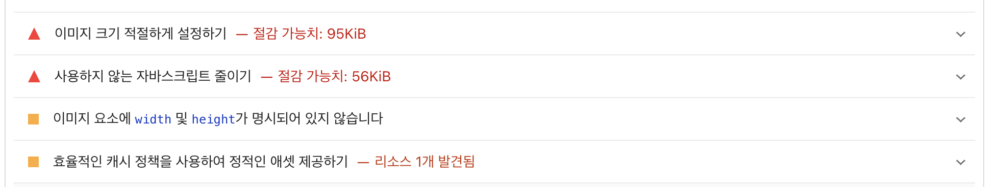

배포 : [웹사이트 링크](https://front-5th-chapter4-2-basic-hsw824.vercel.app/)

## 최적화 보고서

### 최적화 진행 전

### 최적화 진행 후

### 최적화 할 수 있는 것들

- 이미지 리소스 최적화

  - 이미지 크기 조절
    이미지 압축 사이트를 통해 이미지 자체의 크기를 줄였습니다.

  - 반응형에 따른 이미지 로드 방식 변경
    기존에는 모든 디바이스에서 동일한 고해상도 이미지를 로딩하는 방식이 사용되어, 모바일 환경에서도 불필요하게 큰 이미지를 다운로드하게 되는 문제가 있었습니다. 이는 네트워크 낭비뿐 아니라 페이지 로딩 속도 저하로 이어질 수 있습니다. 이를 개선하기 위해 <picture> 요소와 media 속성을 활용한 반응형 이미지 로딩 방식을 적용하였습니다. 디바이스 해상도나 뷰포트 크기에 따라 서로 다른 이미지가 선택적으로 로딩되도록 구성함으로써, 다음과 같은 효과를 얻었습니다:

    1. 모바일 환경에서는 가볍고 작은 이미지(Hero_Mobile.webp)만 로딩
    2. 태블릿 환경에서는 중간 크기의 이미지(Hero_Tablet.webp) 사용
    3. 데스크탑 환경에서는 전체 해상도를 활용한 큰 이미지(Hero_Desktop.webp) 로딩

    이 방식은 미디어 쿼리 기반으로 브라우저가 조건에 맞는 이미지를 사전에 평가하여 선택적으로 로딩하므로, 렌더링 성능 향상과 트래픽 절감 효과를 동시에 기대할 수 있습니다.

  - 이미지 형식 변경(png -> webp)
    기존 png, jpg 형식은 모두 webp로 변경하여 고효율 압축 포맷으로 전환하였습니다.
  - loading : lazy
    loading="lazy" 속성이 설정되면, 이미지는 사용자의 뷰포트에 가까워질 때까지 다운로드되지 않습니다. 이를 추가해서 초기 로딩 속도를 단축시켰습니다.

- css 레이아웃 로딩 최적화

  - display vs opacity
    초기 구현에서는 display: none으로 되어 있었습니다. 이 방식은 브라우저가 해당 요소를 렌더링 트리에서 제거하므로 초기 페인트 비용은 줄일 수 있지만, 나중에 표시할 때는 레이아웃 재계산(Reflow) 과정이 발생해 전환 시 지연이 생길 수 있습니다.
    이를 개선하기 위해 opacity: 0으로 전환하였습니다. 이 방식은 요소를 DOM 및 렌더링 트리에 유지하면서 시각적으로만 숨기기 때문에, 다시 보이게 할 때는 페인트(Paint) 만 발생하여 전환이 부드럽고 빠른 장점이 있습니다.
    마지막으로, 아예 특정 요소는 숨기지 않고 항상 렌더된 상태를 유지하는 방식으로 변경하였습니다. 이를 통해 다음과 같은 이점을 확보했습니다:
    1. 레이아웃 변동 최소화: 레이아웃 시프트 없이 안정적인 구조 유지
    2. 전환 지연 제거: 숨김/표시 전환 시 발생하던 지연 제거

- js 로딩 최적화

  - 처음에 다 보이는 방식 vs 스크롤 이벤트에 따라 보이는 방식
    기존에는 loadProducts() 함수가 페이지 로딩과 동시에 실행되어, 모든 상품 데이터를 즉시 가져오고 DOM에 렌더링하는 방식이었습니다. 이 구조는 사용자가 실제로 해당 섹션을 보기 전임에도 불구하고 모든 데이터를 요청하고 렌더링하므로, 초기 로딩 속도 저하와 불필요한 리소스 낭비 문제가 있었습니다. 특히, 렌더링 이후 실행되는 무거운 반복 계산 루프는 메인 스레드를 블로킹하여 UI가 멈춘 것처럼 보이는 문제도 유발할 수 있었습니다.
    이를 개선하기 위해, 스크롤 이벤트를 활용하여 사용자가 실제로 해당 섹션에 도달했을 때만 데이터를 로드하고 렌더링하는 방식으로 구조를 변경하였습니다. 이 방식은 뷰포트 진입 조건이 충족되기 전까지는 어떤 네트워크 요청도 발생하지 않으며, **초기 렌더링 시점(FCP, LCP)**을 단축시키는 데 효과적입니다.

- font

  - 링크 태그 -> 직접 다운로드
  - 직접 다운로드한 파일을 추가한 것은 다음과 같은 이점이 있습니다.
    1. 로컬 fonts/ 폴더에 있는 폰트 파일은 브라우저에서 정적 자원으로 캐싱 가능
    2. 로컬 폰트는 Vercel에서 서빙되는 정적 파일이기 때문에, 같은 도메인 내에서 즉시 요청 가능, TTF/WOFF2 파일이 캐시되면 더욱 빠르게 로드 가능

- defer 추가
  스크립트 로딩 시 defer 속성을 추가함으로써, HTML 파싱과 JS 실행을 병렬로 처리할 수 있도록 최적화하였습니다. 기존에는 script가 로딩되는 즉시 실행되어 DOM 파싱을 차단할 수 있었지만, defer를 적용하면 전체 문서가 파싱된 후에 스크립트가 실행되므로 초기 렌더링 속도(FCP/LCP) 향상에 도움이 됩니다.

### 정리 표

#### Lighthouse & Core Web Vitals 최적화 전후 비교

| 항목                               | 최적화 전 | 최적화 후 |
| ---------------------------------- | --------- | --------- |
| **Performance**                    | 73% 🟠    | 100% 🟢   |
| **Accessibility**                  | 82% 🟠    | 89% 🟠    |
| **Best Practices**                 | 75% 🟠    | 75% 🟠    |
| **SEO**                            | 82% 🟠    | 82% 🟠    |
| **PWA**                            | 0% 🔴     | 0% 🔴     |
| **LCP (Largest Contentful Paint)** | 14.03s 🔴 | 0.7s 🟢   |
| **CLS (Cumulative Layout Shift)**  | 0.011 🟢  | 0 🟢      |
| **FCP (First Contentful Paint)**   | 0.7s 🟢   | 0.2s 🟢   |
| **Total Blocking Time**            | 120ms 🟢  | 0ms 🟢    |
| **Speed Index**                    | 1.0s 🟢   | 0.8s 🟢   |

> ✅ 최적화 주요 개선 항목:
>
> - LCP 지연 → 이미지 지연 로딩, 폰트 최적화, 불필요한 연산 제거
> - CLS 개선 → 레이아웃 시프트 방지 (width/height 지정 등)
> - 리소스 조건부 로딩 적용 → 초기 렌더링 성능 향상

#### 🛠️ Lighthouse 권장사항 진단 비교 (Best Practices)

| 권장사항 항목                     | 최적화 전 상태               | 최적화 후 상태                          |
| --------------------------------- | ---------------------------- | --------------------------------------- |
| 대규모 레이아웃 변경 피하기       | ❌ 레이아웃 변경 2건 발견    | ✅ 해결됨 (width/height 명시 등 적용)   |
| 차세대 이미지 포맷 사용 (`webp`)  | ❌ 미사용, 절감 가능 1990KiB | ✅ 모든 이미지 `.webp`로 변환           |
| 이미지 크기 최적화                | ❌ 절감 가능 861KiB          | ✅ 이미지 리사이즈 및 lazy loading 적용 |
| 이미지 인코딩 최적화              | ❌ 절감 가능 1410KiB         | ✅ 압축 및 포맷 재처리                  |
| 콘텐츠 포함 최대 페인트 요소 지연 | ❌ LCP 지연 1480ms           | ✅ 초기 렌더링 구조 개선으로 해결       |
| 사용하지 않는 JS 줄이기           | ❌ 절감 가능 56KiB           | ✅ 불필요 스크립트 제거                 |
| 렌더링 차단 리소스 제거           | ❌ 절감 가능 410ms           | ✅ defer 사용, 비동기화 완료            |
| width/height 미지정               | ⚠️ 일부 누락                 | ✅ 모든 이미지에 크기 명시              |
| 캐시 정책 최적화                  | ⚠️ 1개 리소스 비효율         | ✅ 정적 리소스 캐싱 적용                |
| 오프스크린 이미지 지연 로딩       | ❌ 절감 가능 1174KiB         | ✅ `loading="lazy"` 전면 적용           |

> ✅ **대부분의 문제는 이미지 처리, 스크립트 로딩 방식, 레이아웃 안정성 관련 항목으로 구성되며**,  
> 적절한 리팩터링을 통해 거의 모든 경고 항목을 해소하였습니다.
